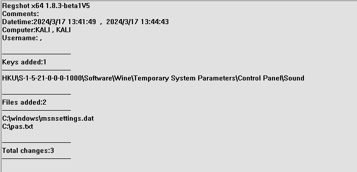

# Labo3-Groupe32

## 2 Les maliciels

### Question 2.1
> Décrire ce qu’est un maliciel ainsi que ses caractéristiques.

Un maliciel est un logiciel se faisant passer comme un outil légitime dans l'objectif d'executer du code malveillant contenu dans l'exécutable.

Ses caractéristiques principales sont:
- Un hash/taille de fichier/métadonnées qui ne correspond pas au logiciel original
- Une version du logiciel non fonctionnel (une erreur est survenue)
- Une signature numérique falsifiée / enlevée

### Question 2.2
> Quelles sont les différentes catégories et fonctionnalités des maliciels.

Sources : 
- [Source principale (en anglais)](https://www.crowdstrike.com/cybersecurity-101/malware/types-of-malware/)
- [Tradutions francaises (tel que recommandé par l'académie francaise)](https://www.academie-francaise.fr/sites/academie-francaise.fr/files/lexique_informatique_et_cybersecurite_2022.pdf)

| Type         | Fonctionnalité |
|:-------------|:---------------|
| Ransongiciel | Désactive l'accès de la victime à ses données tant qu'une rançon n'est pas payée. |
| Maliciel sans fichier | Effectue des modifications dans les fichiers natifs du système d'exploitation |
| Logiciel espion | Collecte des données d'activité des utilisateurs à leur insu |
| Publiciels | Affiche des publicités indésirables |
| Chevaux de Troie | Se déguise en code attrayant |
| Vers | Se propage à travers un réseau en se répliquant |
| Source de Programme Malveillant (Rootkit) | Donne aux pirates le contrôle à distance du périphérique de la victime |
| Enregistreurs de frappe | Surveille les frappes des utilisateurs |
| Maliciel mobile | Infecte les appareils mobiles |
| Maliciel effaceur | Efface irrémédiablement les données des utilisateurs. |

### Question 2.3
> Tenter de trouver des fonctionnalités non données en cours, faire travailler son imagination !

???

## 3 Description de l’environnement

## 4 Utilitaire wine

## 5 Analyse du Malware « Live Messenger »

### Question 5.1
> Illustrer et expliquer les manipulations effectuées.

Comme il est d'usage, il est important de valider les empruntes numériques du fichier fraichement téléchargé:
```sh
$ md5sum "Windows Live Messenger.exe"
a7a75a56b4b960c8532c37d3c705f88f Windows Live Messenger.exe
$ sha1sum "Windows Live Messenger.exe"
e69d26db431e383131826fab5db213559ee68814 Windows Live Messenger.exe
```

Le fichier téléchargé contient un Hash différent de celui annoncé dans le sujet. Le code est donc différent de celui attendu !

### Question 5.2
> Que peut-on déduire du fait que les empreintes ne correspondent pas ?

Une modification non autorisée (soit au site annoncant le Hash, soit sur l'executable lui même) a été effectuée. Cette modification peut être involontaire ou malveillante.

### Question 5.3
> À votre avis, pourquoi est-il utile de vérifier l’intégrité d’un programme téléchargé ?

Il permet de s'assurer qu'aucune modification n'a été effectuée durant le transit, ou sur le site de téléchargement original.

### Question 5.4
> À quoi sert l’outil « Regshot » ?

Regshot est un outil permettant de comparer l'état de l'OS entre deux états choisis. Il permets de détecter les fichiers rajoutés ou modifiés.

### Question 5.5
> Pourquoi utiliser un environnement de « test » cloisonné ?
> 
> Pourquoi utilise-t-on le « snapshot » dans les logiciels de virtualisation (Virtualbox, VMware, . . .) ?

L'utilisation d'un environnement de test cloisonné permet d'éviter (dans la limite du possible) d'être infecté par le maliciel audité.

L'outil de Snapshot des logiciels de virtualisation permettent de revenir en arrière sur l'état de la machine, sans aucune trace des modifications précédentes effectuées.


### Question 5.6
> Illustrer et expliquer les manipulations effectuées.

Après avoir lancé le 1st shot avec l'util Regshot, le programme a été lancé avec wine, et plusieurs tentatives de mot de passe ont été entrées dans le logiciel.

Ensuite, la deuxième capture est effectuée, et le résultat suivant est obtenu par Regshot:



### Question 5.7
> Que constatez-vous dans le rapport généré par Regshot ?
Le rapport indique q'un fichier pas.txt a été créé a la racine du disque.

Aussi, un nouveau fichier de paramètres a été créé dans le dossier windows.

### Question 5.8
> Que contiennent les fichiers créés par le maliciel ?

Le fichier pas.txt contient la dernière tentative de mot de passe effecuée, préfixée/suffixée par un lien vers `www[dot]ourgodfather[dot]com`

Le second (msnsettings.dat) contient les données de MSN manager (les coches selectionnées dans l'application).

### Question 5.9
> À quoi sert « strace » ?

`strace` est un outil permettant de "tracer" / garder une trace de toutes les actions effectuées par le programme.

### Question 5.10
> Illustrer et expliquer les manipulations effectuées.

Une fois la commande `strace` effectuée, il est possible de filtrer les éléments a l'aide de la commande `grep`, disponible par défaut dans une majorité de distributions linux:
```sh
cat output_file | grep pas.txt
stat64("/home/kali/.wine/dosdevices/C:/pas.txt", 0x22f780) = -1 ENOENT (No such file or directory)
stat64("/home/kali/.wine/dosdevices/C:/pas.txt", 0x22f2b8) = -1 ENOENT (No such file or directory)
stat64("/home/kali/.wine/dosdevices/C:/pas.txt", {st_mode=S_IFREG|0644, st_size=93, ...}) = 0
```
(L'output est similaire pour msnsettings.dat).


### Question 5.11
> Quel type de filtre a été utile et efficace pour réaliser la capture ?

Le filtre `%file` permet de limiter la recherche aux fichiers.

### Question 5.12
> Dans l’output de strace, qu’est-il possible de visualiser pour ce cas ? Expliquer en détail.

Nous voyons bien que dans les deux cas, le programme essaiue d'accéder par deux fois a chacun des fichiers, avant de le créer avec un contenu de 93 bytes pour pas.txt, ou 129 pour msnsettings.dat.

### Question 5.13
> Tenter de comprendre comment le maliciel traite le fichier « msnsettings.dat ».

En changeant le dernier paramètre, il est possible de changer la position du fichier pas.txt

### Question 5.14
> Quels types d’informations le fichier comprend-il ?

Différentes valeurs, toutes séparées par des retours a la ligne.

La dernière est le dossier dans lequel le fichier pas.txt sera sauvegardé.

### Question 5.15
> Quelles conclusions en tirez-vous ? Pouvez-vous affirmer ces conclusions ?

A l'aide des recherches faites aux points précédents, il est clair que ce fichier contient la configuration du maliciel, et de ses paramètres d'execution.

### Question 5.16
> Comment fonctionne « fakedns » ?

`fakedns` est une implémentation fictice d'un serveur DNS. Il permet de falsifier des réponses DNS afin d'obtenir les résultats souhaités.

### Question 5.17
> Illustrer et expliquer les manipulations effectuées.

```sh
$ sudo wireshark &
$ sudo python3 fakedns.py 192.168.195.1 &
$ wine Windows\ Live\ Messenger.exe
# Tentative de connexion.
# Nous voyons qu'une tentaive DNS est effectuée vers gsmtp16.google.com sur wireshark.
```

### Question 5.18
> Quels types d’informations ont été capturées grâce à Wireshark ?

Touts les paquets réseau envoyés sur l'interface eth0 ont été capturés par Wireshark.

### Question 5.19
> Expliquer de manière détaillée le comportement du maliciel.

Nous voyons que lors de la tentaive de connexion, une requête DNS est envoyée vers l'address gsmtp16.google.com. ce qui indique qu'un email est tenté d'être envoyé.

### Question 5.20
> Illustrer et expliquer les manipulations effectuées.

```sh
$ sudo inetsim &
$ sudo wireshark &
$ wine Windows\ Live\ Messenger.exe
# tentative de connexion
# observer les paquets envoyés par l'application.
```

### Question 5.21
> Après toutes ces analyses comportementales, pouvez-vous identifier à quel(s) type(s) de maliciels « Windows Live Messenger » appartient ? Pourquoi ?

Le maliciel Windows Live Messenger semble être un Cheval de Troie (plus précisément un voleur d'identifiants). En effet, il essaie de se faire passer pour une application de communication afin d'extraire les identifiants de connexion Windows Live Messenger d'un utilisateur.


### Question 5.22
> Que pouvez-vous en déduire ?

Que le premier champ du fichier de configuration est le mot de passe nécessaire pour afficher le panneau de configuration du maliciel.

### Question 5.23
> À quelle(s) catégorie(s) de codes malveillants appartient ce code malveillant ? (virus, ver, spyware, etc.)


[VirusTotal](https://www.virustotal.com/gui/file/6b34cf6100ac5bf4479250048d61cc4d873dd84af74e5b2771b3205e2dbf0d22) et [MetaDefender](https://metadefender.opswat.com/results/file/6b34cf6100ac5bf4479250048d61cc4d873dd84af74e5b2771b3205e2dbf0d22/hash/overview) considère le logiciel comme un Cheval de Troie (Trojan)

### Question 5.24
> Quelle est l’utilité d’un tel code malveillant ?

L'utilité d'un tel code est d'obtenir les identifiants d'un utilisateur de Windows Live Messenger pour arriver a leurs objectifs.
### Question 5.25
> Comment se propage ce code malveillant ?

La propagation de ce code se fait par un agent malveillant, qui met a disposition le programme sur un ou plusieurs sites compromis / malveillants. Le code en lui même ne contient pas d'outils de réplication.

### Question 5.26
> Comment l’infection par ce code malveillant est-elle réalisée ?

En executant le programme, et en entrant des identifiants dans l'application.


